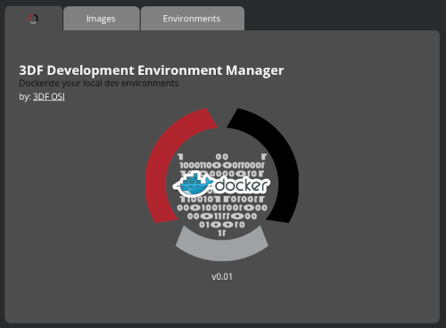

# 3DF Development Environment Manager (DEM)
maintained by: hkdb <hkdb@3df.io>



## About

A cross-platform GUI utility that manages local dockerized development environments built with [Wails](https://wails.io/) using HTML5, CSS, vanilla javascript, and Go.

It takes user input via a graphical interface and assembles docker commands to execute.

Features:

- Add/Edit/Remove images to DB (JSON flat files) for command building
- Add/Edit/Remove containers (environments)
- Start/Stop existing containers (environments)
- One-click access to the containers with terminal emulator
- One-click access to tailing docker log with terminal emulator

This utility was created for internal use and targeted at users that already know docker pretty well. There's a lot of work that needs to be done for input validation and error handling before it can be deemed as a production ready tool.

<b>Side Note:</b> I am not a UI/Graphics guy so the UI was just put together to be practical. I am sure it can be made much "prettier". I am open to PR requests that will make things more visually pleasing.

## Known Issues

I don't really use Windows and there seems to be either some known issues or I am just personally unable to resolve for now:

- Windows executable does not have custom icon (workaround is making a shortcut with ico)
- Windows build title bar does not match system or app theme

## Future Features

- Network Tab so users can create their own standalone docker networks as part of their dev environment

## Dependencies

- Linux / Mac / Windows
- docker / docker desktop
- Windows - `grep` must be installed separately. The easiest way is to use [scoop](https://scoop.sh)

## Installation

Linux:

1. Download tarball: [3DF-DEM-v0.01-x64-Linux.tar.gz](https://github.com/3dfosi/dem/releases/download/v0.01/3DF-DEM-v0.01-x64-Linux.tar.gz)
2. `tar -xzvf 3DF-DEM-v0.01-x64-Linux.tar.gz`
3. `cd 3DF-DEM-v0.01-x64-Linux`
4. `sudo ./install.sh`

Mac:

1. Download dmg: [3DF-DEM-v0.01-x64-Macos.dmg](https://github.com/3dfosi/dem/releases/download/v0.01/3DF-DEM-v0.01-x64-Macos.dmg)
2. Double click dmg
3. Drag and rop DEM icon into Applications folder

Windows

1. Download zip: [3DF-DEM-v0.01-x64-Win.zip](https://github.com/3dfosi/dem/releases/download/v0.01/3DF-DEM-v0.01-x64-Win.zip)
2. Unzip it and place the exe anywhere you want
3. Make a shortcut where you want to and set the icon if you would like with the .ico in zip archive

## Change

- 04182022 - Initial commit

## Development Dependencies

- Linux
	- gcc
	- libgtk3
	- libwebkit
- Mac
	- `xcode-select --install`
- Windows
	- [WebView2](https://developer.microsoft.com/en-us/microsoft-edge/webview2/)

## Wails installation

```
go install github.com/wailsapp/wails/v2/cmd/wails@latest
```

## Live Development

To run in live development mode, run `wails dev` in the project directory. The frontend dev server will run
on http://localhost:34115. Open this in your browser to connect to your application.

## Building

For a production build, use `wails build` or customm build.sh script. To learn more about the custom build.sh script execute `./build.sh -h` from within the repo.

## Disclaimer

This repo is sponsored by 3DF OSI and is maintained by volunteers. 3DF Limited, 3DF OSI, and its volunteers in no way make any guarantees. Please use at your own risk!

To Learn more, please visit:

https://osi.3df.io

https://3df.io
